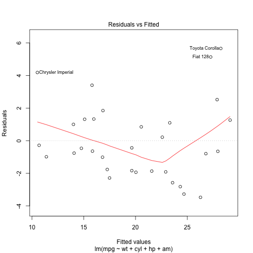
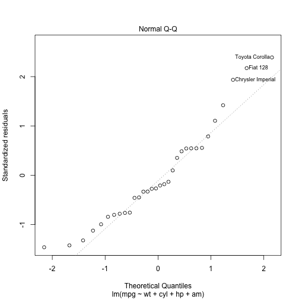
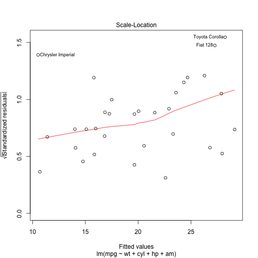
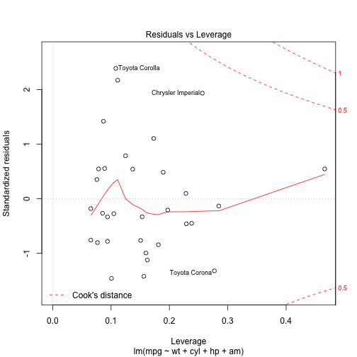

<<<<<<< HEAD
## Inputs
=======
## Available Data
>>>>>>> origin/gh-pages

Standard R distributions typically include the "***mtcars***" dataset. It contains data on 32 automobile models from 1973-1974.
<p>
There are three attributes that are of interest for this study:
* wt - weight of the car in U.S. tons
* cyl - number of cylinders in the car's engine
<<<<<<< HEAD
* hp - Horsepower
* am - Transmission Type(Automatic or Manual)
=======
>>>>>>> origin/gh-pages
* mpg - gas mileage (U.S. miles per U.S. gallon)

--- .class #id 

## The Model

<<<<<<< HEAD
```r
#This is a reference of the previous course Regression Models
```
=======
>>>>>>> origin/gh-pages
We can easily create a linear model to estimate gas mileage given
a car's weight and the number of cylinders in its engine:


```r
<<<<<<< HEAD
model1 <- lm(mpg~., data = mtcars)
model2 <- lm(mpg~am + wt + hp + disp + qsec, data = mtcars)
model <- lm(mpg ~ wt + cyl + hp + am, data=mtcars)
anova(model, model1, model2)
```

```
## Analysis of Variance Table
## 
## Model 1: mpg ~ wt + cyl + hp + am
## Model 2: mpg ~ cyl + disp + hp + drat + wt + qsec + vs + am + gear + carb
## Model 3: mpg ~ am + wt + hp + disp + qsec
##   Res.Df    RSS Df Sum of Sq      F Pr(>F)
## 1     27 170.00                           
## 2     21 147.49  6   22.5033 0.5340 0.7763
## 3     26 153.44 -5   -5.9434 0.1692 0.9711
```

--- .class #id 

## Results

Thus we chose this model as it has the best scores

```r
plot(model)
```

    

The model isn't great, but it's good enough for us to play with.

--- .class #d

## Interactive Demonstration

The following link provides an interactive demonstration of this model:    
   
You will be able to set the number of cylinders and the weight of
the car and see where the resulting predicted mileage fits in with
the rest of the cars.

=======
model <- lm(mpg ~ wt + cyl, data=mtcars)
model
```
>>>>>>> origin/gh-pages

```
## 
## Call:
## lm(formula = mpg ~ wt + cyl, data = mtcars)
## 
## Coefficients:
## (Intercept)           wt          cyl  
##      39.686       -3.191       -1.508
```

--- .class #id 

## Results


```r
model.summary <- summary(model)
model.summary[4]  # coeffecients
```

```
## $coefficients
##              Estimate Std. Error   t value     Pr(>|t|)
## (Intercept) 39.686261  1.7149840 23.140893 3.043182e-20
## wt          -3.190972  0.7569065 -4.215808 2.220200e-04
## cyl         -1.507795  0.4146883 -3.635972 1.064282e-03
```

```r
model.summary[8]  # r-squared
```

```
## $r.squared
## [1] 0.8302274
```

The model isn't great, but it's good enough for us to play with.

--- .class #d

## Interactive Demonstration

The following link provides an interactive demonstration of this model:   
http://jerrymcummings.shinyapps.io/developing-data-products   
   
You will be able to set the number of cylinders and the weight of
the car and see where the resulting predicted mileage fits in with
the rest of the cars.


